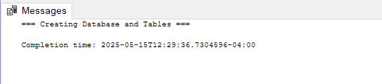
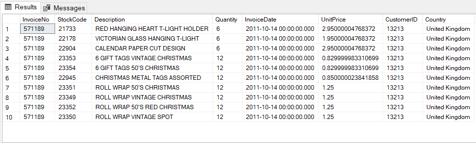
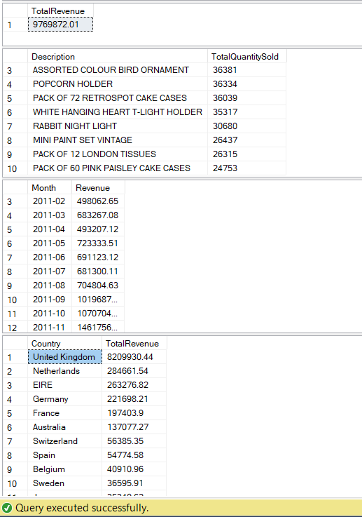
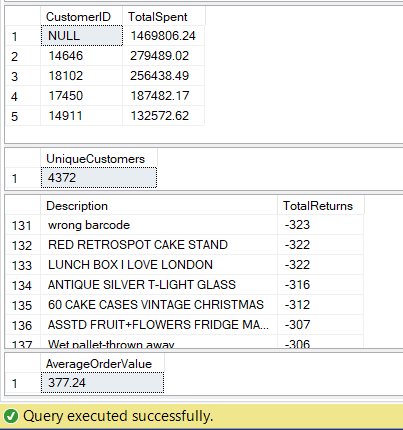

# 🛍️ Retail Analytics Project with Microsoft SQL Server

---

## 📋 Project Overview

This project builds a robust retail analytics pipeline using Microsoft SQL Server:

- **Create database & tables** for raw and cleaned retail data  
- **Import & preview data** with validation  
- **Data cleaning & transformation** using SQL functions  
- **Perform core analytical queries** for business insights  

---

## 🛠️ Technology Stack

- Microsoft SQL Server  
- SQL Server Management Studio (SSMS)  
- T-SQL for ETL & Analytics Queries  

---

## 📂 Project Files

| Filename                          | Description                                    |
|----------------------------------|------------------------------------------------|
| `RetailAnalytics_FullWorkflow.sql` | Full SQL script: database creation, ETL, queries |
| `README.md`                      | Project overview & documentation               |

---

## 🔥 Step-by-Step Workflow with Screenshots

### 1️⃣ Database Creation

Creating the `RetailAnalytics` database and the `Raw_OnlineRetail` table with temporary NVARCHAR columns for smooth data import.

---

### 2️⃣ Data Preview

After importing raw data, previewing the first 10 records to verify successful import.

---

### 3️⃣ Data Cleaning & Transformation

Creating `Cleaned_OnlineRetail` table with proper data types and inserting validated & converted records from the raw table.

---

### 4️⃣ Query Results - Part 1

Executing analytical queries like:

- Total Revenue  
- Top 10 Best-Selling Products  
- Monthly Sales Trend
- Sales by Country  

---

### 5️⃣ Query Results - Part 2

More analytics including:

- Top 5 Customers by Spend  
- Number of Unique Customers  
- Returns Analysis  
- Average Order Value  

---

## 📊 Key Insights

- **Total Revenue:** The project calculates the overall sales revenue effectively.  
- **Best Sellers:** Identifies the products driving the most sales.  
- **Seasonality:** Monthly trends indicate peak sales periods.  
- **Customer Segmentation:** Reveals top customers and purchase patterns.  
- **Returns:** Tracks returned products to monitor quality or satisfaction issues.  

---

## ⚙️ How to Run

1. Open your **SQL Server Management Studio (SSMS)**.  
2. Run the full SQL script (`RetailAnalytics_FullWorkflow.sql`) step-by-step.  
3. Review each query's output to explore insights.  

---

## 🎨 Visual & Design Notes

- Screenshots included to visually guide through each major step.  
- Consistent naming for clarity between raw and cleaned data stages.  
- Queries use `TRY_CAST` and `TRY_CONVERT` to handle data conversion gracefully.  

---

## 📞 Contact & Contributions

Created by **Hetkumar Patel**  
[LinkedIn](https://www.linkedin.com/in/hetkumar-patel) | [GitHub](https://github.com/hetkumarpatel)  

Feel free to contribute or reach out with questions!

---

  Made with ❤️ and SQL 🔥

